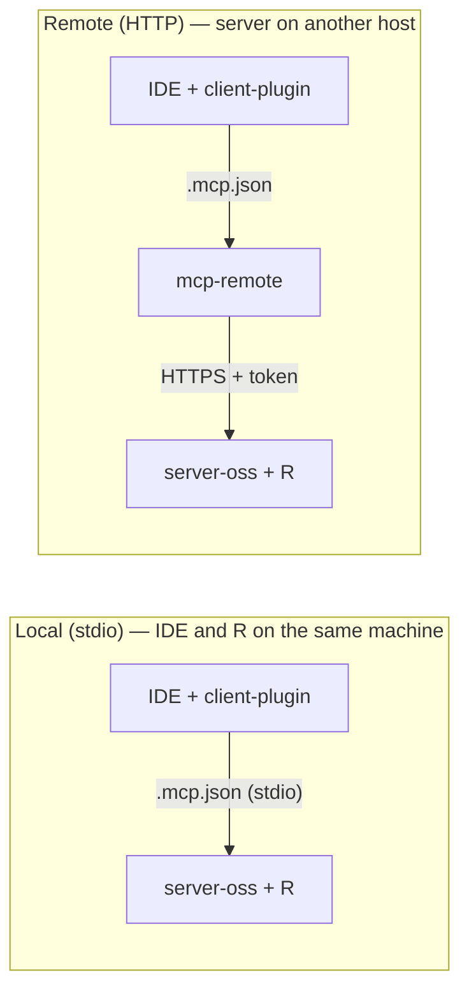

# openair-3-mcp-client-plugin-oss

[](LICENSE)

**The client plugin** — install this in Claude, Cursor, Codex, or VS Code. It connects your IDE to [openair-3-mcp-server-oss](https://github.com/miguel-escribano/openair-3-mcp-server-oss), which you run **locally** (same machine as R) or on **another host**.

Openair plots and public network import from chat — **alongside your usual R workflow**. R runs wherever you host the MCP server (typically **on your own machine** for local setup, or on a remote host if you prefer).

**Not affiliated** with [openair-project](https://github.com/openair-project/openair) maintainers.

- **Manual skills** — ingest, prepare/plot, multi-MCP bridge ([`skills/`](skills/))
- **Workflow skills** — pattern recipes (regional Excel, public network, remote upload)
- **openair-agent** — [`agents/openair-agent.md`](agents/openair-agent.md) guardrails + analyst contract (client orchestrator)
- **Examples** — copy-paste chat workflows for AURN and CSV
- **MCP wiring** — [`.mcp.json.example`](.mcp.json.example) with placeholders only (never commit tokens)

### Architecture



**Local stdio:** IDE spawns the Python server directly — no Node, no HTTP port. **Remote HTTP:** IDE uses `mcp-remote` to reach a server elsewhere.

### Choose your setup

| Path | You need | `.mcp.json` |
|------|----------|-------------|
| **A — Local stdio** | R + openair + Python venv on the **same** machine as the IDE | Spawn `python … --transport stdio` (no Node) — [below](#method-2-local-stdio) |
| **B — Local HTTP** | Same machine; server on port 8001 | `mcp-remote` → `http://127.0.0.1:8001/sse` — [below](#method-1-http--mcp-remote) |
| **C — Remote HTTP** | R on another host; Node on the IDE | `mcp-remote` → your HTTPS URL (+ token if enabled) — [below](#method-1-http--mcp-remote) |

**VS Code:** use the same JSON under `.vscode/mcp.json` with a top-level `"servers"` key instead of `"mcpServers"` (same `command` / `args` per server).

### Binomio

| Repo | Role | Min version |
|------|------|-------------|
| [openair-3-mcp-server-oss](https://github.com/miguel-escribano/openair-3-mcp-server-oss) | **Server** — MCP + R (local or remote host) | **v0.1.0** |
| **openair-3-mcp-client-plugin-oss** (this repo) | **Client plugin** — skills, agent, IDE install | **v0.1.0** (this release) |

### Quick start

1. **Run the server** where R lives — [server README](https://github.com/miguel-escribano/openair-3-mcp-server-oss#choose-your-setup) (local or remote).
2. **Wire MCP** — copy [`.mcp.json.example`](.mcp.json.example) → `.mcp.json` (gitignored). Pick [path A, B, or C](#choose-your-setup). See [CONNECTORS.md](CONNECTORS.md).
3. **Install the plugin**
   - **Claude Code:** `claude plugin install /path/to/openair-3-mcp-client-plugin-oss`
   - **Cursor / Codex / VS Code:** open this folder or add to your plugin path; skills live under `skills/`
4. **Restart** the IDE session after MCP config changes.

## Using skills

Two ways to activate the harness:

1. **Natural language (default)** — describe your **data modality** and goal. Include what you know: path, datetime column, pollutant, timezone, site code, dates.
2. **Direct invoke** — `@ingest-local-export`, `@ingest-local`, `@prepare-plot`, `@regional-excel`, etc. when routing fails (Cursor / VS Code / Codex).

| You have… | Keywords / invoke | Skill |
|-----------|-------------------|-------|
| **Dev / VS Code smoke** (remote MCP) | *felisa fixture, test data* · see [vscode-chat-felisa.md](examples/vscode-chat-felisa.md) | Read `tests/fixtures/felisa_munarriz.json` → prepare → plot |
| CSV/Excel on server | *csv, xlsx, disk path* · `@ingest-local` | `ingest-local` → `prepare-plot` |
| CSV/Excel on your PC (remote MCP) | *local file, export script* · `@ingest-local-export` | `ingest-local-export` → `prepare-plot` |
| Attachment / Downloads (last resort) | *attachment, upload* · `@remote-file-upload` | `remote-file-upload` workflow |
| Regional Excel portal | *Fecha/hora, dedupe, portal* · `@regional-excel` | `regional-excel` workflow |
| AURN / EU network | *import AURN, site code* · `@ingest-network` | `ingest-network` → `prepare-plot` |
| Another MCP | *json_exports, API, postgres* · `@multi-mcp` | `multi-mcp` → `prepare-plot` |
| Which openair plot? | ask in chat · [plot-catalog.md](examples/plot-catalog.md) | `openair_docs` on the server — not a plugin skill |

**You are the analyst:** supply column names, timezone, and paths when you know them. The agent should ask, not guess. For openair methodology see the [official book](https://openair-project.github.io/book/).

## Getting your data in

| Your data | Path |
|-----------|------|
| **Smoke / dev** (remote MCP, no Excel) | `tests/fixtures/felisa_munarriz.json` → prepare → plot — [vscode-chat-felisa.md](examples/vscode-chat-felisa.md) |
| CSV / Excel on **server disk** | `load_series_from_*` → prepare → plot (file must exist **on server host**) |
| File on **your PC** (remote MCP) | `export_local_series.py` or `load_series_from_upload` (last resort) → prepare → plot |
| **AURN / EU** public data | `import_*` → prepare → plot |
| **Another MCP** (API, Postgres, Airtable, …) | Upstream MCP tool → `prepare_series_for_openair(json_exports=[…])` → plot |

Merge multiple MCP servers in `.mcp.json` — see [CONNECTORS.md](CONNECTORS.md). Upstream exports must be structured JSON ([SeriesV1 schema](https://github.com/miguel-escribano/openair-3-mcp-server-oss/blob/main/schemas/series.v1.json)); never hand-build arrays in chat.

**Remote MCP:** do not assume example server paths (`data/felisa.xlsx`) exist. Guardrail **O6** in [`openair-agent.md`](agents/openair-agent.md).

### What you can ask

| You have | Example prompt |
|----------|----------------|
| Plugin repo open (VS Code remote MCP) | “Use `tests/fixtures/felisa_munarriz.json`, prepare hourly Europe/Madrid, time_plot all pollutants — MCP only” |
| Excel on your PC + remote MCP | “Navarra export at `C:\…\felisa.xlsx`, Fecha/hora, Europe/Madrid — export script then prepare and time_plot” |
| CSV on **server host** (local stdio or uploaded) | “Load `/path/on/server/data.csv`, datetime `date`, PM10, Europe/Madrid, prepare hourly, time_plot” |
| AURN / EU network | “Import MY1 NO2 for Jan–Mar 2023 and time plot it” |
| Data from another MCP | “Fetch hourly PM2.5 from [upstream MCP], prepare, and time plot” |

## Examples

| Walkthrough | Workflow skill |
|-------------|----------------|
| [examples/vscode-chat-felisa.md](examples/vscode-chat-felisa.md) | **VS Code remote MCP** — committed fixture, no Excel hunt |
| [examples/aurn-time-plot.md](examples/aurn-time-plot.md) | [`public-network-plot`](skills/workflows/public-network-plot/SKILL.md) |
| [examples/csv-calendar-plot.md](examples/csv-calendar-plot.md) | `ingest-local` + `prepare-plot` |
| [examples/local-excel-spain.md](examples/local-excel-spain.md) | [`regional-excel`](skills/workflows/regional-excel/SKILL.md) |
| [examples/plot-catalog.md](examples/plot-catalog.md) | Plot picker — all MCP plot tools |

## Testing (acceptance gate)

This repo owns the **golden-path harness** — the authoritative check that deployed MCP produces correct plots.

| Item | Location |
|------|----------|
| Fixture | `tests/fixtures/felisa_munarriz.json` |
| Harness | `tests/run_series_exercises.py` (12) · `tests/run_wind_exercises.py` (4) |
| Output | `tests/output/series/` · `tests/output/wind/` (gitignored) |
| Docs | [tests/README.md](tests/README.md) |

```powershell
$env:OPENAIR_MCP_TOKEN = "…"
python tests/run_series_exercises.py
python tests/run_wind_exercises.py
```

Server repo `pytest` + `fixtures/` cover ingest/prepare units only — run both tiers before a release.

**VS Code Copilot:** [examples/vscode-chat-felisa.md](examples/vscode-chat-felisa.md) — same data as the harness, no Excel file hunt.

## Do I need Python?

- **Python runs the MCP server** alongside R — infrastructure on the host you choose, not your analysis language.
- **You do not write Python or R** for Excel/CSV when using **Disk** (`load_series_from_*`) or **Upload** (`load_series_from_upload`).
- **Recommended:** local stdio for regional Excel exports; `ingest-local-export` (export script) for remote MCP with local files. Upload (`load_series_from_upload`) is the last resort for small files — default 1 MB, configurable on the server via `OPENAIR_INGEST_MAX_BYTES`.

All date parsing, dedupe, and alignment happen on the server (guardrails O1–O6 in `agents/openair-agent.md`).

## Installation detail

### Method 1: HTTP + mcp-remote

Use for **local HTTP** (`127.0.0.1`) or a **remote** server. Start the server over HTTP first ([server README → Running the server](https://github.com/miguel-escribano/openair-3-mcp-server-oss#running-the-server)), then point the plugin at its URL:

```json
{
  "mcpServers": {
    "openair-3-mcp": {
      "command": "npx",
      "args": [
        "-y",
        "mcp-remote",
        "http://127.0.0.1:8001/sse",
        "--header",
        "X-MCP-Token: YOUR_MCP_TOKEN"
      ]
    }
  }
}
```

- **Local:** `http://127.0.0.1:8001/sse` — drop `--header` … if you have no token auth.
- **Remote:** your server URL instead of localhost; add the token header when your proxy requires it.

Requires **Node.js 18+** on the IDE machine.

### Method 2: Local stdio

IDE and R on the **same** machine — no HTTP server, no `mcp-remote`:

```json
{
  "mcpServers": {
    "openair-3-mcp": {
      "command": "/path/to/openair-3-mcp-server-oss/.venv/bin/python",
      "args": ["-m", "fastmcp", "run", "server.py:mcp", "--transport", "stdio"],
      "cwd": "/path/to/openair-3-mcp-server-oss"
    }
  }
}
```

Windows: use `.venv\\Scripts\\python.exe`. The `command`/`cwd` above point at a server checkout — set the server up first (clone, Python deps, R packages): [server README → Quick start](https://github.com/miguel-escribano/openair-3-mcp-server-oss#quick-start).

### Plugin layout

```
skills/openair/            # Router — auto-routes to specialist skills
skills/ingest-local/       # Manual — CSV/Excel on server disk
skills/ingest-local-export/ # Manual — agent-run export script (local file + remote MCP)
skills/ingest-network/     # Manual — import_aurn, import_europe, …
skills/prepare-plot/       # Manual — prepare → one plot
skills/multi-mcp/          # Manual — json_exports bridge
skills/workflows/          # Pattern recipes (regional Excel, network, upload)
agents/openair-agent.md          # Guardrails O1–O6, analyst contract, routing
examples/                  # Copy-paste walkthroughs (start with vscode-chat-felisa.md for remote MCP)
tests/                     # Acceptance harness + felisa_munarriz.json
.mcp.json.example          # Client config template (safe to commit)
CONNECTORS.md              # Server + optional MCP pairing
```

## Optional pairing (multi-MCP)

Install **openair-3-mcp** alongside any MCP that returns time-series JSON:

| Upstream (examples) | Role |
|---------------------|------|
| REST / sensor API MCP | Fetch readings |
| Database MCP (e.g. Postgres read-only) | Query hourly tables |
| Spreadsheet MCP (e.g. Airtable) | Export structured rows |
| Custom data pipeline MCP | Emit `series_v1` JSON |

Chain: **upstream tool** → `prepare_series_for_openair(json_exports=[…])` → plot tool on openair MCP.

Requirements: deterministic JSON from the upstream tool ([SeriesV1](https://github.com/miguel-escribano/openair-3-mcp-server-oss/blob/main/schemas/series.v1.json) or compatible export). Standalone CSV / `import_*` users do not need a second MCP.

## Scope

This binomio provides **charts and data access** through MCP, powered by openair on R. It does not include interpretation, compliance advice, or health guidance — those belong in your own reporting workflow.

For methodology, see the [openair book](https://openair-project.github.io/book/). Teams that pair generative AI with air-quality data often add a **controlled knowledge base** for narrative beyond plots; that layer is separate from this chart stack.

**Release v0.1.0** — initial public release: `openair-agent` persona (`agents/openair-agent.md`), ingest/prepare/plot skills, workflow recipes, multi-MCP bridge, Felisa WindSeriesV1 fixture + **15-tool acceptance harness** (`tests/`). Pair with the server at the **same release**. [Issues](https://github.com/miguel-escribano/openair-3-mcp-server-oss/issues) and feedback welcome.

## Third-party and attribution

This project is **not affiliated** with [openair-project](https://github.com/openair-project/openair). If you use it — commercial or not — please attribute the parts you rely on.

### openair (software)

Charts and statistics are produced by the **[openair](https://github.com/openair-project/openair)** R package (MIT). In papers, reports, or published figures, cite:

> Carslaw, D. C. and K. Ropkins (2012). *openair — an R package for air quality data analysis.* Environmental Modelling & Software, 27–28, 52–61. [doi:10.1016/j.envsoft.2011.09.008](https://doi.org/10.1016/j.envsoft.2011.09.008)

BibTeX and updates: [openair citation](https://openair-project.github.io/openair/authors.html). In R: `citation("openair")`.

### Public air-quality data

`import_aurn`, `import_europe`, and related tools fetch **third-party datasets**, not data shipped with this repo. You must follow each provider’s licence when you publish or redistribute results.

| Source | Typical requirement |
|--------|---------------------|
| **UK networks (AURN, etc.)** | [Open Government Licence](https://www.nationalarchives.gov.uk/doc/open-government-licence/version/3/). Attribute Defra / [uk-air.defra.gov.uk](https://uk-air.defra.gov.uk/). |
| **European networks** | Respect source terms; openair notes EU import availability (see `import_europe` docs). |
| **Your CSV** | Your responsibility only. |

Example UK data attribution (OGL):

> © Crown copyright Defra via uk-air.defra.gov.uk, licensed under the Open Government Licence.

### This MCP wrapper (optional)

**openair-3-mcp-server-oss** and **openair-3-mcp-client-plugin-oss** are MIT. You do not need our permission for non-commercial or commercial use. If this MCP binomio was part of your workflow and you publish methods, a brief mention or link to the GitHub repos is appreciated — but the **scientific citation above is openair**, not this wrapper.

## License

MIT — see [LICENSE](LICENSE). See **Third-party and attribution** for openair and data sources.
